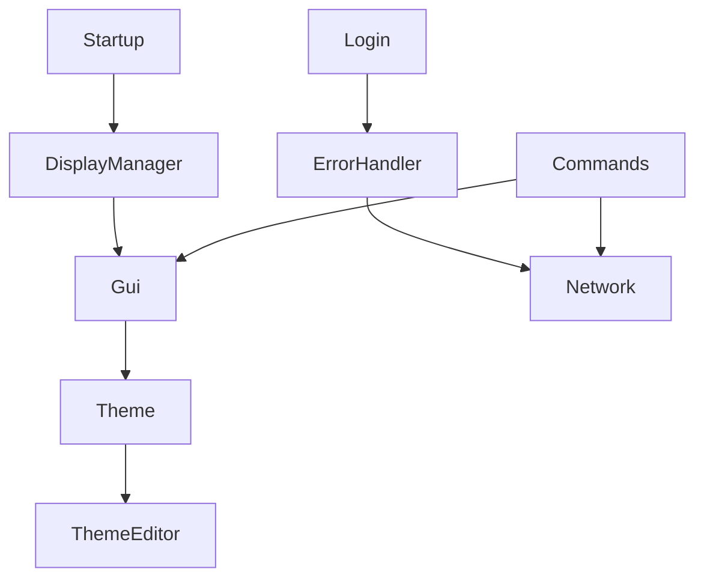
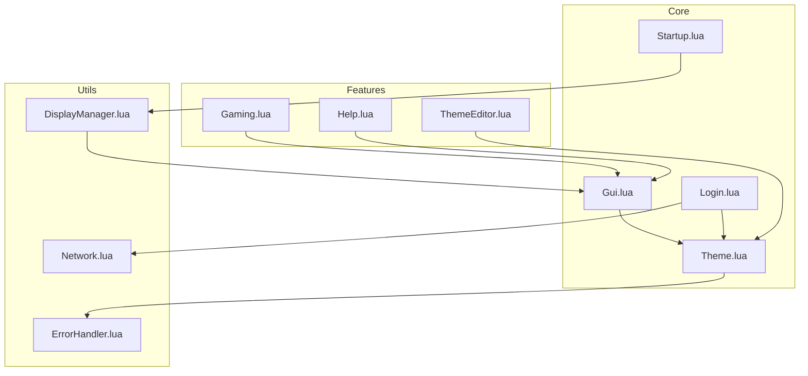

# SCIOS File Structure

## Project Overview
- **Type**: ComputerCraft Operating System
- **Language**: Lua
- **Platform**: CC:Tweaked
- **Primary Purpose**: Modular, theme-aware operating system with networking capabilities

## File Dependencies and Relationships


## Core Files

### Startup.lua
- **Purpose**: System initialization and boot sequence
- **Dependencies**: DisplayManager, ErrorHandler
- **Key Functions**:
  - System startup
  - Module loading
  - Environment setup

### Theme.lua
- **Purpose**: Visual styling and UI rendering
- **Dependencies**: ErrorHandler
- **Key Functions**:
  - Color management
  - UI element rendering
  - Theme hot-reloading
- **Data Structures**:
  - Theme configuration
  - Color palettes
  - UI element templates

### Gui.lua
- **Purpose**: Window and interface management
- **Dependencies**: Theme, ErrorHandler
- **Key Functions**:
  - Window creation/management
  - Event handling
  - Component rendering

### Login.lua
- **Purpose**: User authentication
- **Dependencies**: Theme, ErrorHandler, Network
- **Key Functions**:
  - User verification
  - Session management
  - Access control

### Network.lua
- **Purpose**: Inter-computer communication
- **Dependencies**: ErrorHandler
- **Key Functions**:
  - Message handling
  - Computer discovery
  - Protocol management

### ErrorHandler.lua
- **Purpose**: Error management and recovery
- **Dependencies**: None
- **Key Functions**:
  - Error catching
  - Logging
  - Protected execution

## Feature Modules

### Gaming.lua
- **Purpose**: Game management and execution
- **Dependencies**: Gui, Theme
- **Key Functions**:
  - Game loading and execution
  - Score tracking
  - Game state management

### Help.lua
- **Purpose**: Documentation and assistance
- **Dependencies**: Gui, Theme
- **Key Functions**:
  - Command documentation
  - Tutorial management
  - Context-sensitive help

### ThemeEditor.lua
- **Purpose**: Real-time theme customization
- **Dependencies**: Theme, Gui
- **Key Functions**:
  - Color palette editing
  - Theme preview
  - Theme saving/loading

## Utility Files

### Commands.lua
- **Purpose**: Command processing
- **Dependencies**: Gui, Network
- **Core Functionality**: User input handling and command execution

### DisplayManager.lua
- **Purpose**: Screen management
- **Dependencies**: Term API
- **Core Functionality**: Terminal operations and buffer management

### Installer.lua
- **Purpose**: System installation
- **Dependencies**: HTTP API
- **Core Functionality**: Download and setup procedures

## Documentation Structure

### README.md
- Project overview
- Installation guide
- Feature list
- Basic usage

### journey.md
- Active tasks
- Completed tasks
- Pending tasks
- Development milestones

### project-log.md
- Change history [Feature/Fix/Refactor]
- Implementation details
- Development decisions

### files.md
- File relationships
- Component purposes
- System architecture
- Development guidelines

## Data Management

### filetracker.db
- **Type**: Database file
- **Purpose**: File system management
- **Structure**: Key-value pairs for file tracking

## Development Guidelines

### Code Organization
```lua
-- Standard module structure
local dependencies = require("dependencies")
local module = {}
-- Local variables
local config = {}
-- Function definitions
function module.initialize() end
-- Return module
return module
```

### File Naming
- **System Files**: PascalCase.lua
- **Documentation**: kebab-case.md
- **Data Files**: snake_case.db

### Module Dependencies


### Module Dependencies
- Explicit requires at file start
- Circular dependency prevention
- Error handler integration
